# AI 大模型拟人日系立绘生成 · WorkBuddy Skill

给任意 AI 大模型、产品或品牌设计一套**日系平涂赛璐璐风格的拟人化全身立绘**。除了 AI 模型，也支持把冰箱、洗衣机这类器物按「特征人设」拟人化。

风格锚定为小红书 Astraumbra《各大主流 AI 大模型拟人形象整理》系列：干净黑线稿 + 日系平涂薄渐变上色 + 纯色底 + 静态站姿全身构图，并遵循 **「模型特点 → 视觉符号」** 的人设推导逻辑——不是随便画个二次元少女，而是让每个模型的梗在角色身上落到实处。

## 效果

内置 19 张参考图，开箱即用，无需自备素材。

**正常比例（6.5–7 头身）**

| GPT · 白龙 | Claude · 古书 | Kimi · 三棱镜长裙 | DeepSeek · 鲸鱼女仆 |
|---|---|---|---|
| 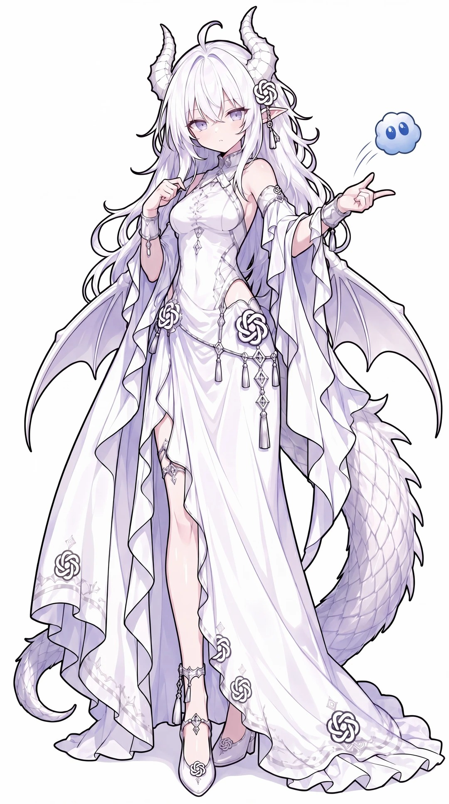 | 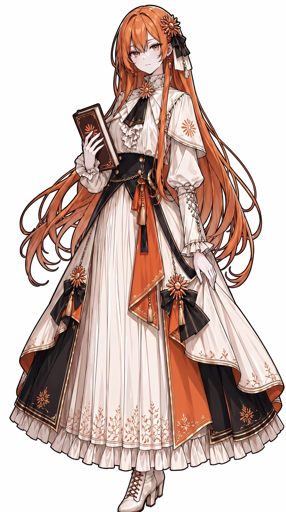 | 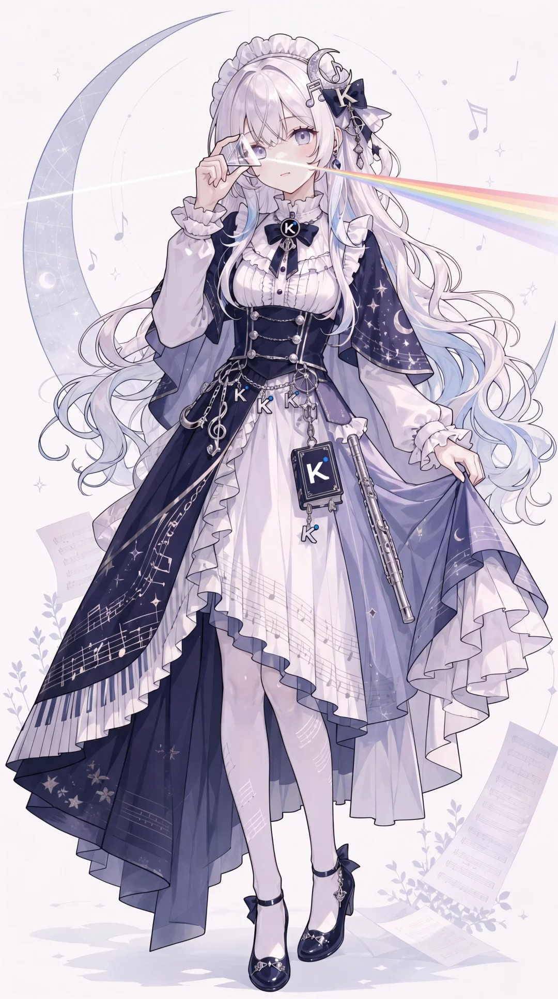 | 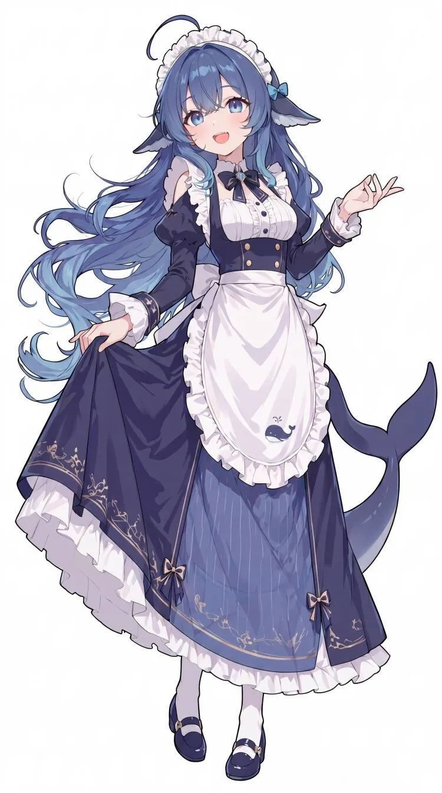 |

| Grok · 战斧 | 智谱 · 国风礼服 | MiniMax · 场记板 | Mistral · 法棍猫耳 |
|---|---|---|---|
| 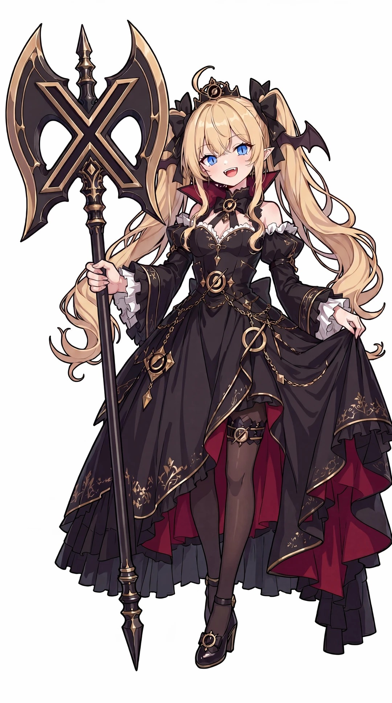 | 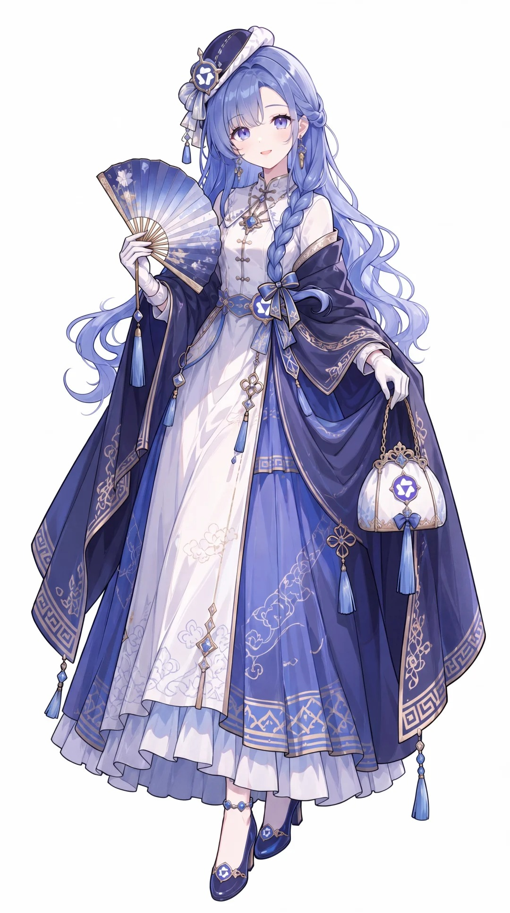 | 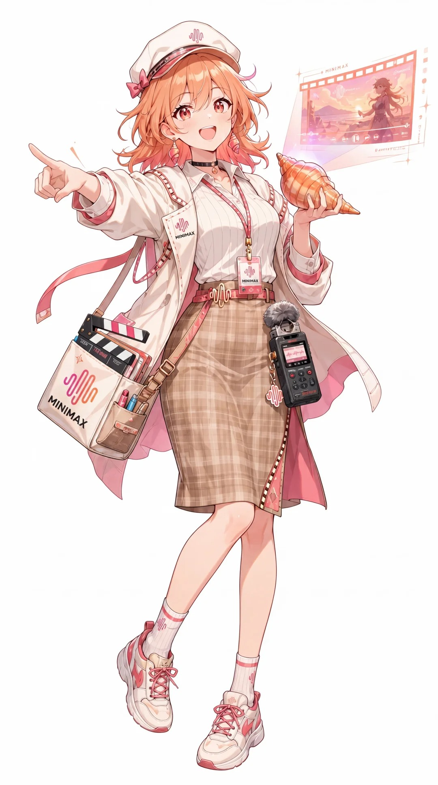 | 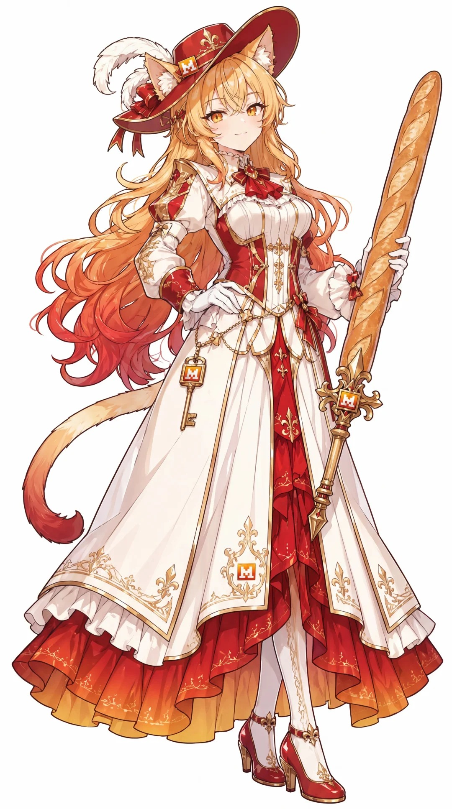 |

**Q 版（2–3 头身）**

| 黑蓝舞娘 | 紫黑慵懒 | 国风斗篷冷淡 | 白金制服 | 运动服 |
|---|---|---|---|---|
| 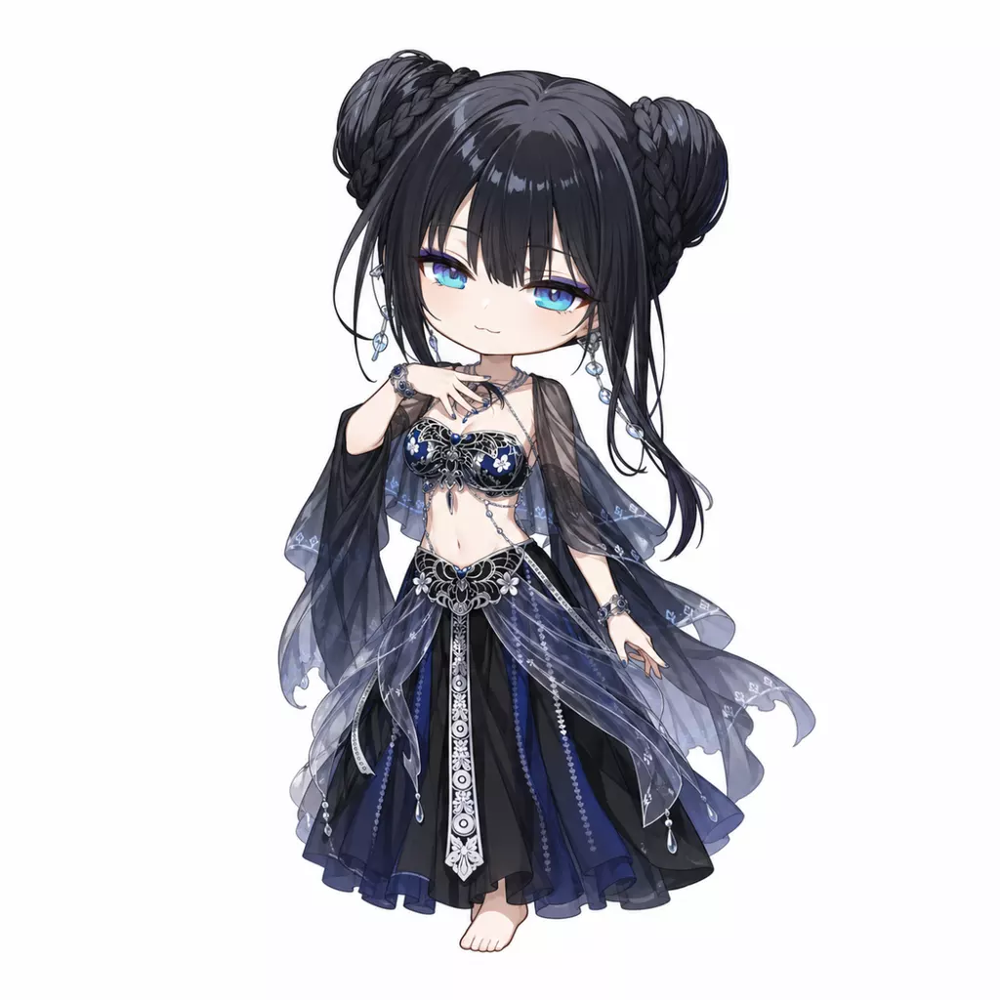 | 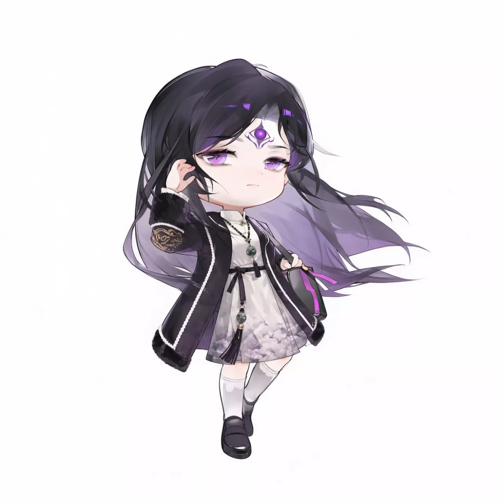 | 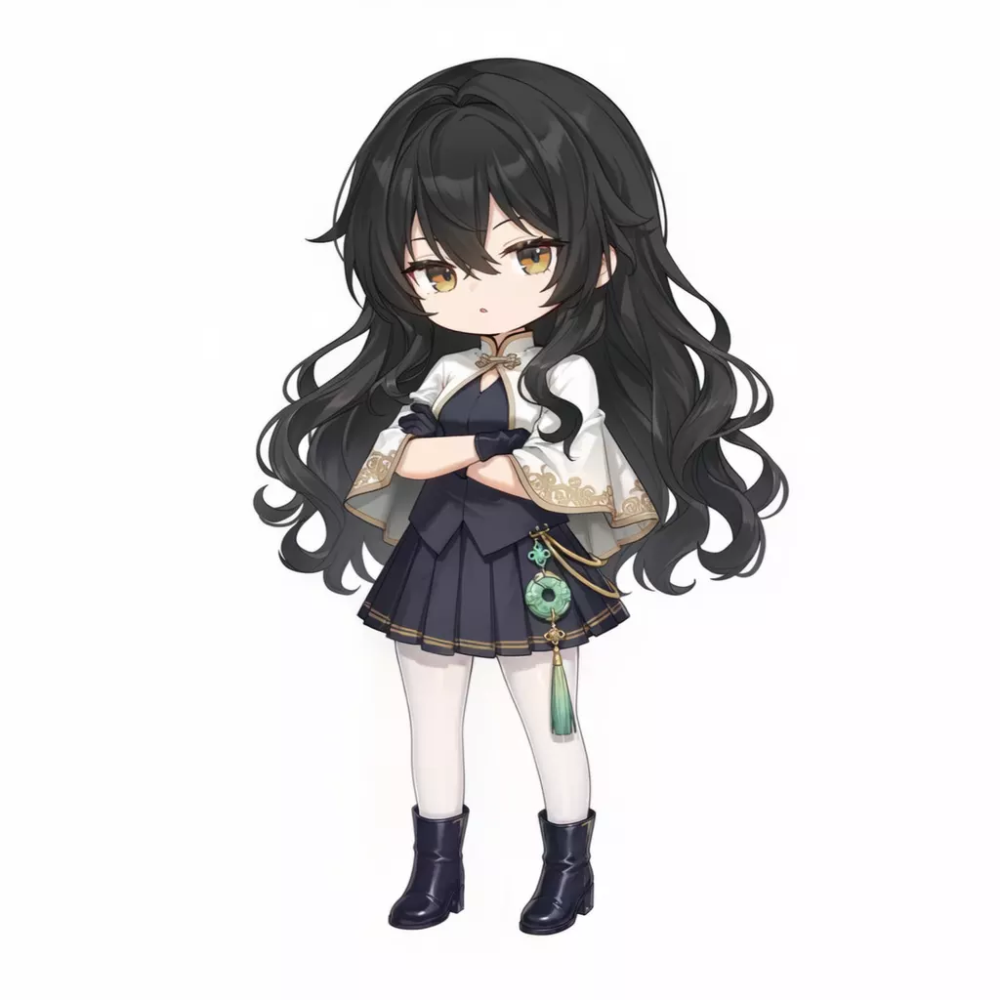 | 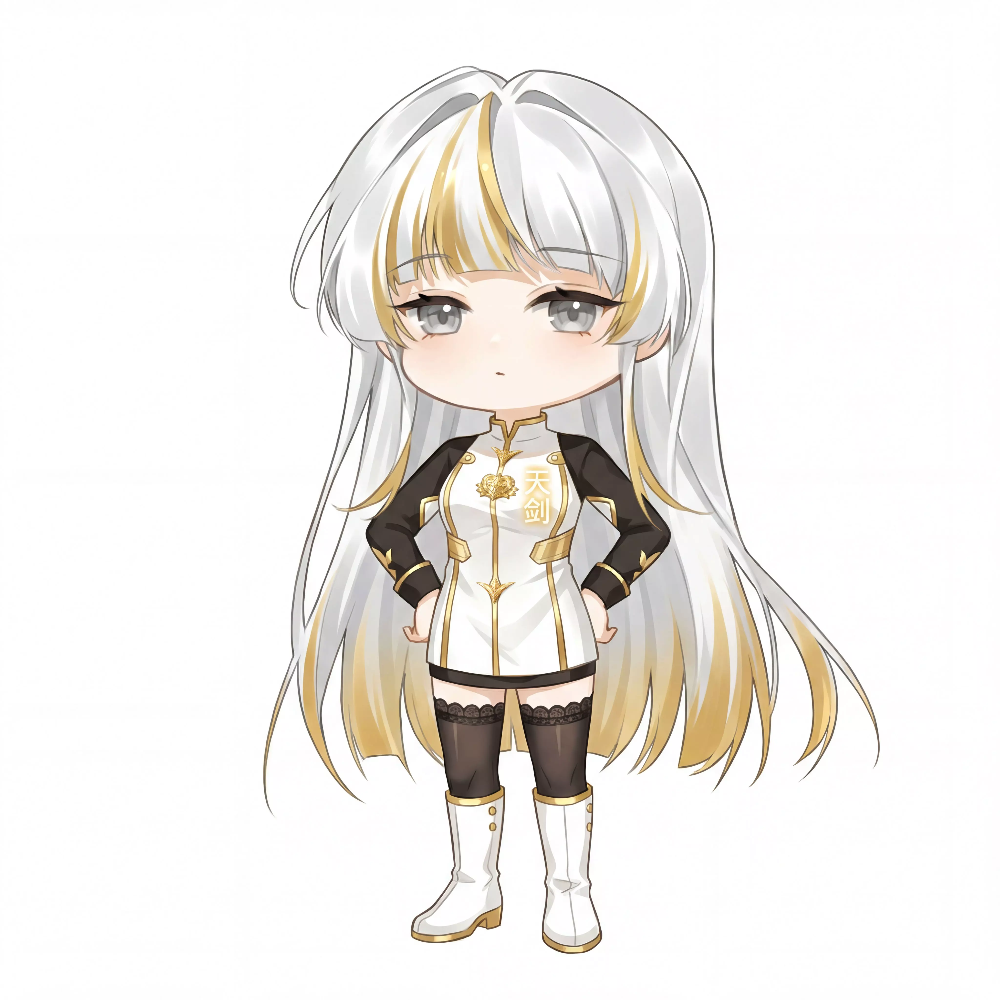 | 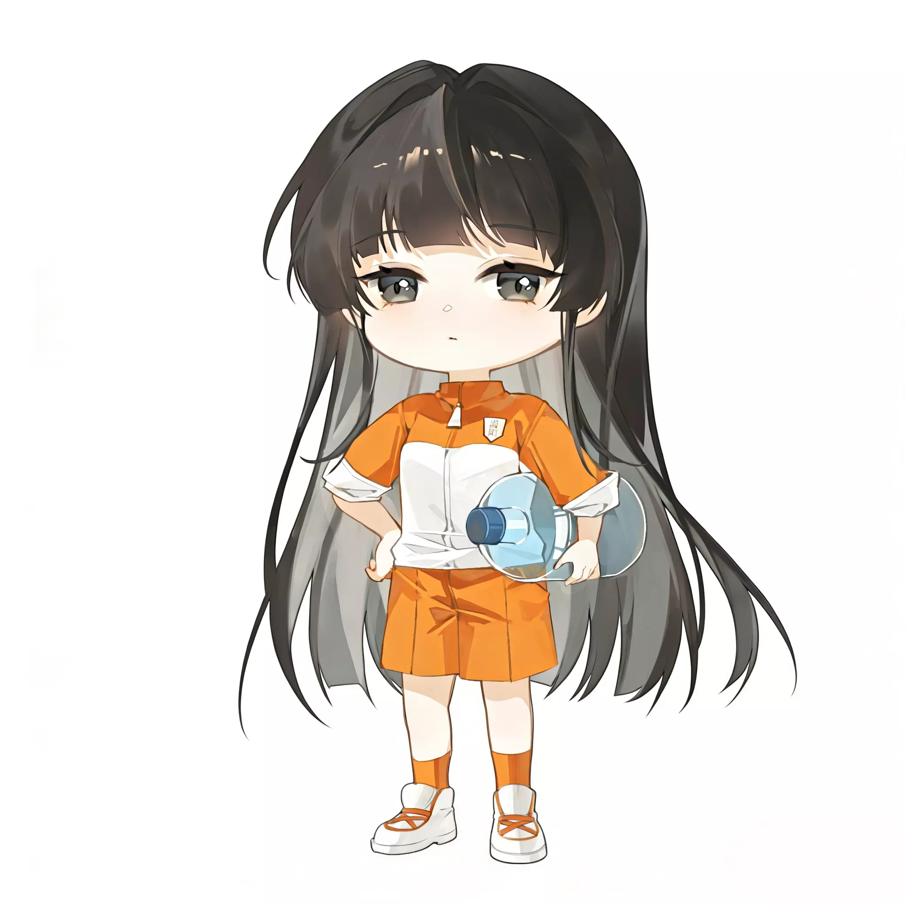 |

## 核心能力

- **三种比例模式**：正常比例（6.5–7 头身）、Q 版 chibi（2–3 头身）、已有立绘转 Q 版（image-to-image，原设计符号逐项保留）
- **符号先行的设计流程**：先提炼「代表动物 / 品牌主色 / 核心能力道具」三要素并向你复述确认，确认后才画图，避免跑偏
- **画风锁定**：生成新角色时自动把系列内最接近的一张参考图作为 image reference 传入，锁住线稿与上色质感
- **器物拟人走「特征人设」**：冰箱、洗衣机、电饭煲这类物品默认把特征降维成服装结构与配饰（门→对开襟、抽屉→分层裙、面板→腰包挂饰），而不是往身上挂一台冰箱本体——除非你点名要本体造型
- **服装风格匹配时代属性**：现代工业 / 科技产物自动走现代都市、tech-wear、制服系，不会给家电套一身复古洋装；只有传统器物、非遗、历史题材才用国风礼服
- **严格的提问纪律**：所有选项（比例、原型、动作、配色、背景）问齐之后才动笔生成，且任何一次修改都视为槽位变更、重新确认，不会擅自沿用上次的答案
- **内置防跑偏规则**：
  - 娘化防跑偏——历史人物 / 武侠 / 男性角色题材强制少女化提示词，避免出美少年脸
  - 少年防娘化——题材本体为男性时反向锁定
  - 平涂防厚涂——粗豪 / 武士 / 深肤色题材强制压回赛璐璐平涂
  - 皮肤红线——种族特征只出现在角、兽耳、尾巴、发色瞳色等「可摘除的配件层」，皮肤必须是正常人类肤色
- **10 项审图清单**：生成后逐项核对（全身无裁切、视觉符号齐备、无意外文字叠加等），不合格主动重 roll

## 安装

需要 [WorkBuddy](https://www.workbuddy.cn)（本技能调用其 ImageGen 能力）。三种方式任选。

### 方式一：命令行安装（最快）

```bash
npx skills add Noir-R/anime-anthro --skill ai-model-anime-anthro
```

### 方式二：从 SkillHub 安装

在 [SkillHub](https://skillhub.cn) 搜索「AI 娘」或「拟人立绘」，复制安装指令粘贴到 WorkBuddy 对话框发送即可。

> **注意**：SkillHub 平台拒收二进制媒体（`.png/.jpg/.jpeg/.webp/.svg` 等一律返回 400），因此该渠道的版本**不含 19 张参考图**，包体约 40 KB。首次使用时技能会自动运行 `scripts/fetch_assets.py` 从公开 CDN 拉取参考图；若你的网络访问不了，可从本仓库 `assets/` 手动下载放入。参考图缺失不影响生成，但画风一致性会下降。
>
> 需要开箱即用的完整版，请用方式一或方式三（GitHub 仓库自带全套图片）。

### 方式三：手动放置

```bash
git clone https://github.com/Noir-R/anime-anthro.git ai-model-anime-anthro
cp -r ai-model-anime-anthro ~/.workbuddy/skills/
```

也可以下载本仓库 Release 里的 `ai-model-anime-anthro.zip`，用 WorkBuddy 技能面板的「上传技能」直接导入。

| 系统 | 用户级技能目录 |
|---|---|
| Windows | `C:\Users\<你的用户名>\.workbuddy\skills\` |
| macOS / Linux | `~/.workbuddy/skills/` |

确认路径正确（**多套一层目录是最常见的错误**）：

```
~/.workbuddy/skills/ai-model-anime-anthro/SKILL.md
```

**重启 WorkBuddy** ——技能在会话启动时加载，正在运行的旧会话不会自动识别新技能。

> `assets/` 必须一起带走，否则参考图缺失，画风锁不住。

## 用法

新会话中直接说需求即可触发：

```
给 Gemini 画个拟人立绘
娘化林黛玉，Q 版
把这张立绘转成 Q 版
```

也可显式调用：`/ai-model-anime-anthro`

未指定的部分会主动询问（立绘比例、人物原型、动作、配色、背景），不会替你擅自假设。

## 目录结构

```
ai-model-anime-anthro/
├── SKILL.md                    主流程（四问步骤 + 提示词组装 + 审图清单）
├── INSTALL.md                  安装说明
├── references/
│   ├── style-guide.md          技法规范 + 符号映射先例库 + Q 版规范 + 负面清单
│   └── prompt-templates.md     正常比例 / Q 版 / 转 Q 版 三套提示词模板
└── assets/                     全套参考图（已内置，无需外部素材）
    ├── style-ref-*.jpg         正常比例系列参考 14 张
    └── chibi-ref-*.webp        Q 版参考 5 张
```

## 注意

- 涉及真实品牌时仅做**同人风格视觉设计**，不冒充官方形象。
- 生成图像会调用图像模型并消耗积分，与在哪台机器运行无关，走的是同一个账号。
- 生成图右下角可能带 AI 合规水印，属正常现象。

## License

MIT
